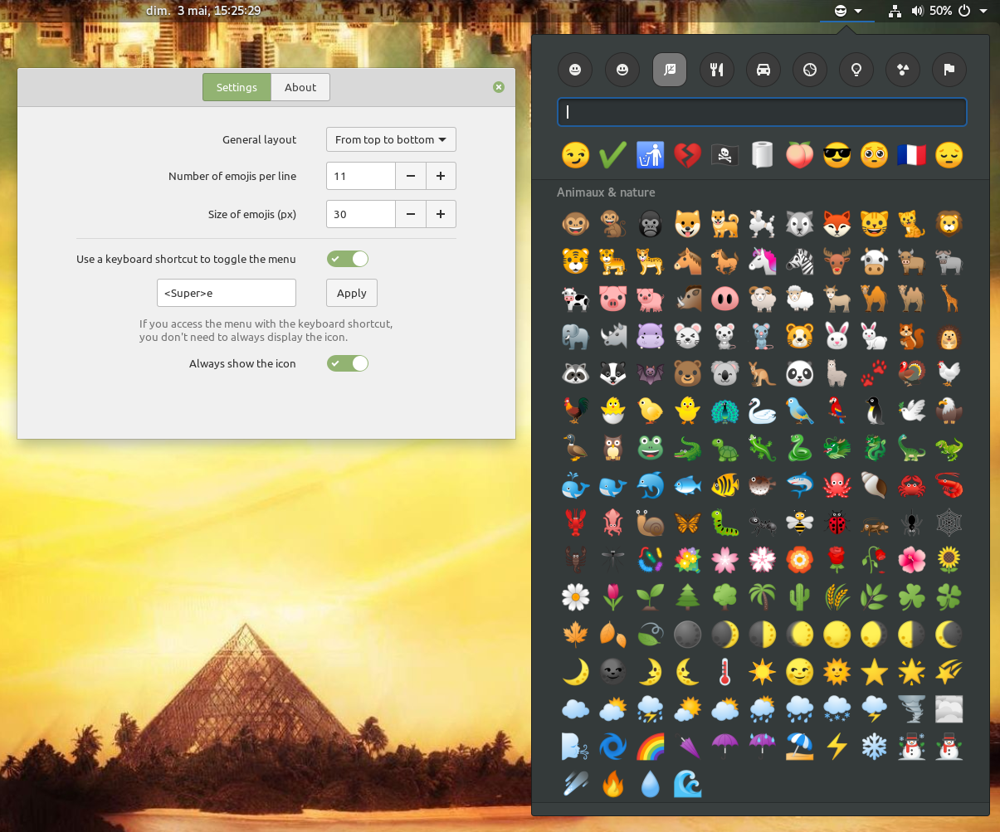

# Emoji Selector (for GNOME Shell)

This GNOME shell extension provides a searchable popup menu displaying most emojis ; Clicking on an emoji copies it to your clipboard.

## Features

>**currently Unicode 11** ([soon 12](https://github.com/maoschanz/emoji-selector-for-gnome/issues/28))

- keyboard shortcut to open the extension's menu (<kbd>Super</kbd>+<kbd>E</kbd> by defaut)
- dynamic search (press <kbd>Enter</kbd> to copy the first result to the clipboard)
- lots of parametrable things
- skin tone & gender modifiers
- middle-click to set to the cliboard without closing the menu (or <kbd>Ctrl</kbd>+<kbd>Enter</kbd>)
- right-click to add the emoji at the end of the current clipboard content (or <kbd>Shift</kbd>+<kbd>Enter</kbd>)

The keyboard navigation is designed to work **with <kbd>Tab</kbd>, not the arrows**.

## About fonts

It will be less ugly if you have the « Noto Emoji » font, the
« [Twitter Color Emoji](https://github.com/eosrei/twemoji-color-font/releases) »
font, or the « JoyPixels Color » font installed on your system.

## About memory performance

Loading hundreds of small pictures and thousands of keywords into the memory is
a lot. Despite a few attempts to optimize their loading, I'm not an expert at
all concerning memory management, and the extension may be responsible for
between 10MB and 60MB of memory usage, which is a lot. Don't blame the actual GS
devs for it.

## Contributors & translations

Various contributions to the code itself:

- [Ryan Gonzalez](https://github.com/kirbyfan64)
- [amivaleo](https://github.com/amivaleo)
- [xurizaemon](https://github.com/xurizaemon)

<!--TODO bah eux ^ ils sont pas crédités dans l'UI du coup ??-->

The extension is currently available in the following languages:

- Castillan (thanks to mario-mra)
- Simplified chinese (thanks to larryw3i)
- Dutch (thanks to vistaus)
- Esperanto (thanks to nicolasmaia)
- German (thanks to jonnius)
- Italian (thanks to amivaleo)
- Polish (thanks to alex4401)
- Brazilian portuguese (thanks to nicolasmaia, picsi & frnogueira)
<!-- TODO if no update from them, manually add their names to the .po files
          before the release -->

If you need another language, please contribute!

----

## Installation

#### Default way to do

The better option is to install it from [here](https://extensions.gnome.org/extension/1162/emoji-selector/).

#### Native packages

- [`gnome-shell-extension-emoji-selector-git` (**AUR**)](https://aur.archlinux.org/packages/gnome-shell-extension-emoji-selector-git/)
- ...<!-- TODO à compléter -->

#### Manual installation

Download and extract the ZIP, then open a terminal in the project's directory,
and run `./install.sh`. It should copy the "emoji-selector@maestroschan.fr"
folder to `~/.local/share/gnome-shell/extensions/`, which can be done manually
if you prefer.

You may need to restart the GNOME Shell environment (logout and login again, or
<kbd>Alt</kbd>+<kbd>F2</kbd> -> `r` ->, <kbd>Enter</kbd>).

